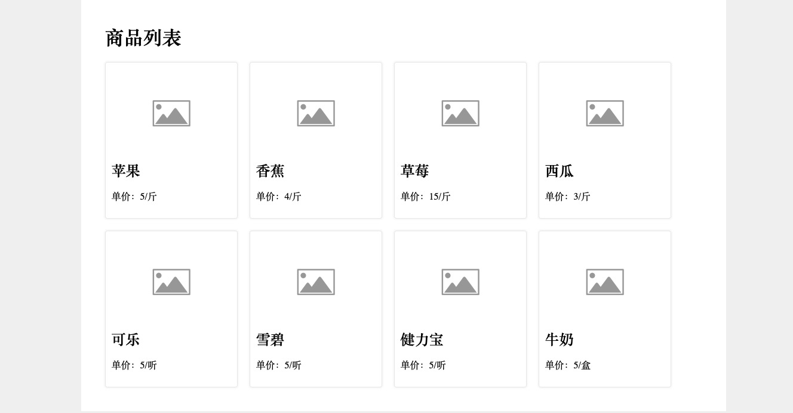
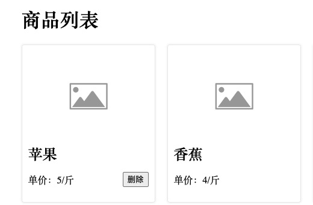

# 需求说明

## Story 1：根据 api 数据渲染商品列表

### 技术提示
**注意：不能修改html内容**

1. 从`http://localhost:3000/products` 获取商品数据信息
2. 根据商品信息渲染页面
3. 商品图片可以用： `assets/placeholder-image.png`

效果如下, 样式接近即可： 



## Story 2 删除商品

* 鼠标放在商品上显示 "删除" 按钮， 鼠标移开 "删除" 消失
* 点击 "删除" 按钮，可以删除商品
* 刷新页面，已删除的商品不会再显示

**技术提示： 需要删掉服务器（json-server）上的数据**




# 环境准备

### 下载依赖

```bash
npm install
```

### 运行测试

```bash
npm test
```

### 启动 Json Server 

```
npm run server
```
启动 json server 后可以        
获取 products 数据: `GET http://localhost:3000/products`  
删除指定 id 的 product: `DELETE http://localhost:3000/products/${id}`  

**你可能需要了解更多关于 [json-server](https://github.com/typicode/json-server)**

### Linting Your Code

```bash
$ npm run lint
```
